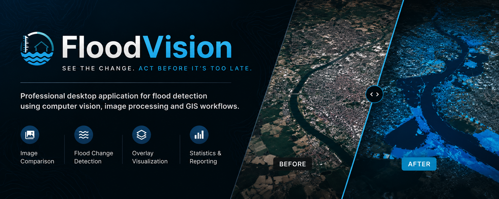
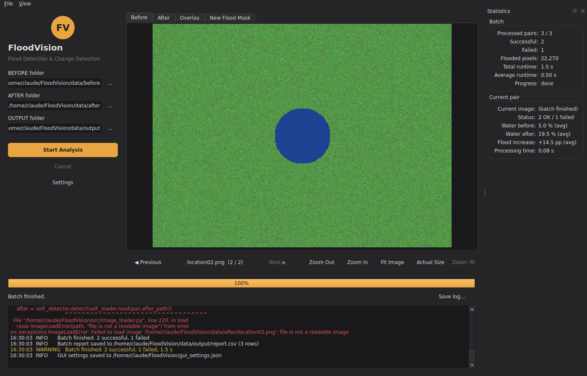
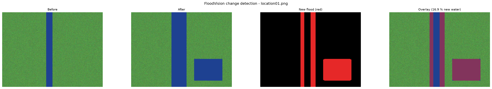

<p align="center">
  
</p>


# 🌊 FloodVision


Professional desktop application for flood detection using computer vision and image processing.

FloodVision compares two images of the same location ("Before" and "After") and automatically detects newly flooded areas.

---

## Features

### Image Processing

- Automatic water detection
- Flood change detection
- Before/After image comparison
- Overlay visualization
- New flood mask generation
- Batch processing
- Automatic image pairing
- Robust error handling

### Desktop GUI

- Modern PySide6 desktop application
- Dark theme
- Before / After / Overlay / Flood Mask preview
- Zoom In
- Zoom Out
- Fit Image
- Actual Size (100%)
- Image navigation
- Progress bar
- Live log console
- Statistics panel
- Folder selection

### Reporting

- CSV report generation
- Comparison images
- Water coverage statistics
- Flood increase calculation
- Batch summary

---

## Technologies

- Python 3.12
- PySide6
- OpenCV
- NumPy
- Pillow
- Matplotlib
- PyYAML

---

## Installation

```bash
git clone git@github.com:robpi82/FloodVision.git
cd FloodVision

python3 -m venv .venv
source .venv/bin/activate

pip install -r requirements.txt
```

---

## Run

Desktop GUI

```bash
python gui_main.py
```

Command Line

```bash
python main.py
```

---

## Folder Structure

```text
FloodVision
│
├── assets/
├── data/
│   ├── before/
│   ├── after/
│   ├── output/
│   ├── processed/
│   └── raw/
│
├── src/
│   ├── gui/
│   ├── batch_processor.py
│   ├── change_detection.py
│   ├── config.py
│   ├── exceptions.py
│   ├── image_loader.py
│   ├── mask_generator.py
│   ├── report_generator.py
│   ├── utils.py
│   ├── visualization.py
│   └── water_detection.py
│
├── gui_main.py
├── main.py
├── config.yaml
├── requirements.txt
└── README.md
```

---

## Screenshots

### Desktop Application



### Flood Detection Analysis



### Flood Overlay Visualization


---

## Current Version

### Version 0.7.0

Implemented

- Professional desktop GUI
- Image navigation
- Zoom controls
- Statistics panel
- Live logging
- CSV export
- Batch processing
- Overlay visualization
- Automatic report generation
- Automatic image pairing
- Robust error handling

---

## Roadmap

### Version 0.7.1

- macOS image panning improvements
- Drag & Drop support
- Better image navigation
- GUI usability improvements

### Version 0.8

- GeoTIFF support
- Rasterio integration
- Coordinate systems
- GIS workflows

### Version 0.9

- Sentinel-2 imagery
- Landsat imagery
- Raster processing
- GIS export

### Version 1.0

- AI flood segmentation
- Deep Learning models
- U-Net integration
- PyTorch support

---

## Author

Robert Piotrowicz

GitHub

https://github.com/robpi82

---

## License

MIT License

Educational and portfolio project.