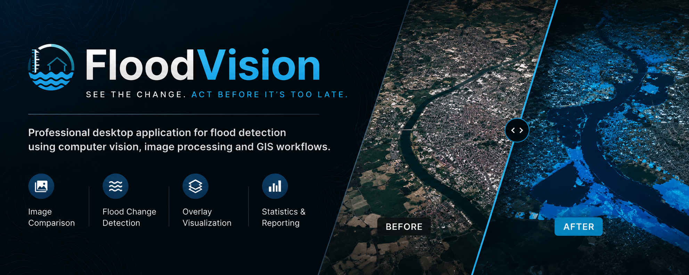
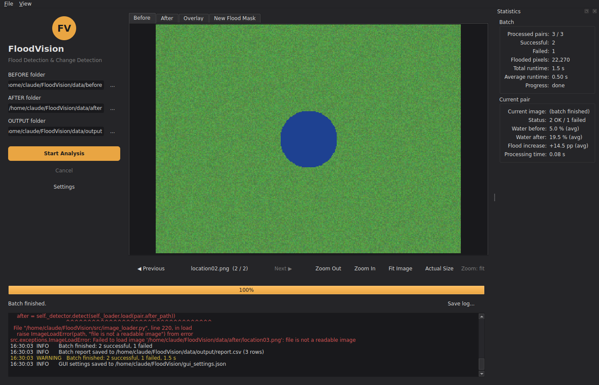
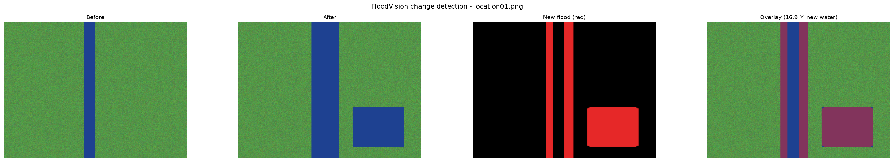
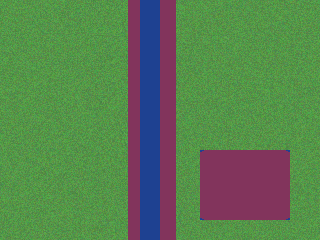

<p align="center">
  
</p>

# 🌊 FloodVision


Professional desktop application for flood detection using computer vision, image processing, and geospatial raster analysis.

FloodVision compares two images of the same location ("Before" and "After") and automatically detects newly flooded areas.

The current stable release v0.9.2 provides multispectral GeoTIFF processing, Sentinel-2 support, NDWI and MNDWI foundations, reliable spectral band resolution, and NoData-aware water detection with validity-mask handling. Development in v0.10.0 focuses on turning this spectral foundation into an operational Sentinel-2 flood-analysis workflow with configurable detection modes, real Sentinel-2 data workflows, spectral visualizations, and GIS-ready analysis outputs.

---

## Features

### Image Processing

* Automatic water detection
* Flood change detection
* Before / After image comparison
* Overlay visualization
* New flood mask generation
* Batch processing
* Automatic image pairing
* Robust error handling

### Desktop GUI

* Modern PySide6 desktop application
* Dark theme
* Before / After / Overlay / New Flood Mask / Spectral Index preview
* Drag & Drop folder support
* Folder path input
* Folder browser integration
* Detection-method selection between HSV and Sentinel-2 spectral analysis
* Spectral index selection between NDWI and MNDWI
* Configurable spectral-index threshold
* False-colour NDWI/MNDWI visualization
* Georeferenced NDWI/MNDWI GeoTIFF export
* Sentinel-2 band import dialog (individual files or a whole folder)
* Previous / Next image navigation
* Zoom In
* Zoom Out
* Fit Image
* Actual Size (100%)
* Improved image navigation
* Progress bar
* Live log console
* Statistics panel
* GeoTIFF Information Panel
* Automatic GeoTIFF metadata display
* Progress tracking
* Batch processing summary

The detection method is chosen in **Settings → Water detection method**:

* HSV mode is intended for standard RGB images such as PNG, JPEG and RGB GeoTIFF files.
* Sentinel-2 spectral mode is intended for compatible multispectral GeoTIFF files containing the required Sentinel-2 Green and NIR (NDWI) or Green and SWIR (MNDWI) bands.

The choice is persisted across restarts, and the HSV threshold controls are automatically disabled while spectral mode is active.

While spectral mode is active, a second control selects the spectral index:

* NDWI (Green / NIR, bands B03/B08) is the default and works well for open water.
* MNDWI (Green / SWIR, bands B03/B11) is more robust against turbid water and built-up areas.

The spectral-index control is disabled while HSV mode is active, and its selection is likewise persisted across restarts.

A **Threshold** control alongside the spectral index sets the minimum index value classified as water, from -1.00 to 1.00 (default 0.10). A lower threshold classifies more area as water; a higher threshold classifies less. Like the spectral-index control, it is only enabled while spectral mode is active and its value is persisted across restarts.

For spectral-mode runs, a fifth **Spectral Index** preview tab shows the raw NDWI/MNDWI raster as a false-colour image (blue = water-like, red/brown = land-like, grey = no data) -- a direct view of what the threshold above is actually filtering. The corresponding `before_index.png`/`after_index.png` files are written alongside the other batch outputs; HSV-mode runs produce neither the files nor a populated preview tab, since there is no continuous index to show.

For spectral-mode runs on GeoTIFF pairs specifically, the raw NDWI/MNDWI values are additionally exported as georeferenced `before_index.tif`/`after_index.tif` files -- single-band float32 rasters carrying the source CRS and affine transform, ready to open directly in QGIS or ArcGIS Pro for custom thresholding or overlay with other layers. Unlike the flood mask export, invalid pixels are written with a real NoData value (NaN) rather than a valid third class, since a missing index value is genuinely different from "not water".

Real Sentinel-2 products ship each spectral band as its own file, often at different native resolutions (10 m for B02/B03/B04/B08, 20 m for B11). **File → Import Sentinel-2 Bands...** opens a dialog to select those individual files (or point at a whole folder and let it detect band codes automatically from filenames such as `T33UUP_20230615T101031_B03_10m.jp2`), then combines them -- resampling any 20 m band onto the finer 10 m grid -- into a single georeferenced GeoTIFF written directly into the Before or After folder, ready for a completely normal batch run.

This workflow has been verified end-to-end against real Copernicus Data Space Ecosystem Sentinel-2 L2A data (not just synthetic test fixtures): two full-resolution acquisitions of the same tile (10980 x 10980 px each) were imported, combined, and run through a complete spectral batch analysis, including the georeferenced index export, without any code changes.

### GeoTIFF & GIS Support

Available since FloodVision v0.8.0:

* Rasterio integration
* GeoTIFF file detection and validation
* GeoTIFF metadata extraction
* Coordinate Reference System (CRS) extraction
* EPSG code extraction
* Raster bounds extraction
* Pixel resolution extraction
* Raster dimensions and band information
* Raster data type information
* NoData value extraction
* Affine transform metadata extraction
* GeoTIFF pair compatibility validation
* CRS compatibility checks
* Raster dimension compatibility checks
* Pixel resolution compatibility checks
* Raster bounds compatibility checks
* Affine transform compatibility checks
* Structured compatibility results and mismatch reporting
* Tolerance-based comparison of geospatial values
* GeoTIFF compatibility validation integrated into batch processing
* Automatic spatial compatibility checks before GeoTIFF pair processing
* Safe rejection of incompatible GeoTIFF pairs
* Safe rejection of mixed image and GeoTIFF pairs
* Batch processing continuation after compatibility failures
* GeoTIFF raster data loading
* Raster pixel data extraction as NumPy arrays
* Band-first raster data representation
* Single-band and multi-band raster support
* NoData-aware raster loading
* Valid-data mask generation
* GeoTIFF raster loading error handling
* GeoTIFF image adapter
* Conversion of three-band GeoTIFF raster data to RGB images
* Band-first NumPy array to Pillow RGB image conversion
* Automatic scaling of numeric raster data to uint8
* NoData-aware RGB image conversion
* Invalid raster pixels masked as black
* Validation of supported raster band configurations
* Productive GeoTIFF raster workflow integration
* Automatic routing between legacy images and GeoTIFF raster processing
* GeoTIFF raster loading integrated into batch processing
* GeoTIFF RGB image adaptation integrated into batch processing
* Compatible three-band GeoTIFFs processed through the existing water detection pipeline
* Legacy PNG and JPEG processing workflow preserved
* Georeferenced GeoTIFF export for detected flood masks
* Single-band uint8 GeoTIFF output using 0/255 flood classification values
* Preservation of CRS, affine transform, raster dimensions, and spatial bounds
* Automatic GeoTIFF flood mask export during batch processing
* GIS-ready flood detection results for use in QGIS and ArcGIS Pro

### Multispectral Raster Support

Available in the current stable release FloodVision v0.9.2:

* Multispectral GeoTIFF support
* Configurable raster band selection
* Selection of arbitrary source bands for RGB image generation
* Validation of multispectral band configurations
* Preservation of existing three-band RGB workflows
* Sentinel-2 spectral band metadata foundation
* Immutable Sentinel-2 band metadata model
* Metadata definitions for B02, B03, B04, B05, B06, B07, B08, B8A, B09, B10, B11, and B12
* Native spatial resolution metadata for supported Sentinel-2 bands
* Normalized and validated Sentinel-2 band lookup
* Sentinel-2 band code to zero-based raster index conversion
* Preservation of requested Sentinel-2 band order during raster index conversion
* GeoTIFF band description loading via Rasterio
* Preservation of GeoTIFF band descriptions in raster data
* Automatic Sentinel-2 RGB band selection from GeoTIFF band descriptions
* Validation of required Sentinel-2 RGB bands in raster band descriptions
* Support for partially missing GeoTIFF band descriptions
* Sentinel-2 RGB band resolution despite unrelated missing band descriptions
* Productive batch processing support for partially missing Sentinel-2 band descriptions
* Clear error reporting when required Sentinel-2 RGB bands are missing
* Resolution of B04, B03, and B02 from the actual raster band order
* Integration of Sentinel-2 band descriptions into productive GeoTIFF processing
* Complete Sentinel-2 band metadata catalog
* NDWI spectral index calculation
* MNDWI spectral index calculation foundation
* NumPy-based spectral index processing independent from image processing
* Spectral water detection using Sentinel-2 Green and NIR bands
* NDWI threshold-based water mask generation
* Spectral water coverage calculation
* Compatible `WaterDetectionResult` integration
* Strategy-compatible spectral detection architecture alongside RGB-based detection
* Automated spectral water detection tests
* Automated spectral batch integration tests
* NoData-aware spectral water detection
* Exclusion of invalid raster pixels from spectral water masks
* Exclusion of invalid raster pixels from water coverage statistics
* Validation of spectral validity-mask dimensions
* Safe handling of rasters without valid pixels

### GeoTIFF Information Panel

FloodVision provides visible geospatial metadata directly in the desktop application.

When browsing a processed GeoTIFF result, the GeoTIFF Information Panel automatically displays:

* Coordinate Reference System (CRS)
* EPSG code
* Raster width and height
* Number of raster bands
* Pixel resolution
* NoData value
* Raster bounds

For standard images without geospatial metadata, the panel displays a neutral information state.

The panel is implemented as a dedicated PySide6 dock widget and automatically updates when navigating between processed image pairs.

### Reporting

* CSV report generation
* Comparison images
* Water coverage statistics
* Flood increase calculation
* Batch summary
* Automatic output folder generation

### Automated Testing

* pytest test infrastructure
* pytest-qt GUI testing infrastructure
* Synthetic GeoTIFF test data
* GeoTIFF metadata loader tests
* GeoTIFF compatibility validation tests
* GeoTIFF batch integration tests
* GeoTIFF raster loader tests
* GeoTIFF image adapter tests
* Productive GeoTIFF pipeline integration tests
* GeoTIFF-to-RGB processing path tests
* GeoTIFF Information Panel tests
* GUI initial state tests
* GUI metadata display tests
* GUI non-GeoTIFF state tests
* GUI panel reset tests
* Raster pixel data tests
* Multi-band raster tests
* RGB conversion tests
* Raster data scaling tests
* NoData handling tests
* NoData masking tests
* Unsupported band configuration tests
* Unsupported GeoTIFF band configuration tests
* Non-finite raster value tests
* Error handling tests
* CRS and EPSG tests
* Floating-point tolerance tests
* Cross-platform GUI settings tests
* Automatic fallback tests for invalid machine-specific directory paths
* Georeferenced GeoTIFF export tests
* GeoTIFF CRS preservation tests
* GeoTIFF affine transform preservation tests
* GeoTIFF raster dimension preservation tests
* GeoTIFF 0/255 flood mask value tests
* GeoTIFF export integration tests
* Multispectral band selection tests
* Four-band GeoTIFF integration tests
* Sentinel-2 band metadata tests
* Parameterized Sentinel-2 band metadata tests
* Sentinel-2 band index conversion tests
* Raster-aware Sentinel-2 band index resolution tests
* GeoTIFF band description loading tests
* Partial Sentinel-2 band description handling tests
* Batch integration tests for partially missing Sentinel-2 band descriptions
* Sentinel-2 band-description-based RGB selection integration tests
* Missing Sentinel-2 RGB band validation tests
* NDWI calculation tests
* MNDWI calculation tests
* Spectral band extraction tests
* Spectral water detection tests
* Spectral detector integration tests
* Spectral batch processing integration tests
* Valid-mask shape validation tests
* Invalid-pixel exclusion tests
* Fully masked raster handling tests
* Individual Sentinel-2 band file stacking tests
* Mixed-resolution (10 m/20 m) band resampling tests
* Bilinear vs nearest-neighbour resampling behaviour tests
* Resampled validity-mask propagation tests
* Sentinel-2 band CRS mismatch validation tests
* Combined multi-band Sentinel-2 GeoTIFF writer tests
* Round-trip tests confirming the combined GeoTIFF is readable by the unmodified existing GeoTIFF loader and spectral detector
* Sentinel-2 band file import dialog tests (band-code detection, folder scanning, combine success/failure paths)
* Full-resolution preview image allocation limit tests
* Complete regression test suite with 314 passing tests
* End-to-end Sentinel-2 Before/After batch integration test
* Productive spectral detector routing test
* Georeferenced spectral flood mask export validation
* NoData-aware change detection tests
* Shared Before/After validity-mask tests
* Invalid-pixel exclusion from flood statistics
* Fully invalid raster comparison tests

---

## Technologies

* Python 3.12
* PySide6
* OpenCV
* NumPy
* Pillow
* Matplotlib
* PyYAML
* Rasterio
* pytest
* pytest-qt
* Ruff

---

## Installation

```bash
git clone git@github.com:robpi82/FloodVision.git
cd FloodVision

python3 -m venv .venv
source .venv/bin/activate

pip install -r requirements.txt
```

### Development Dependencies

To install the development and testing dependencies:

```bash
pip install -r requirements-dev.txt
```

The development dependencies include:

* pytest
* pytest-qt
* Ruff

---

## Run

### Desktop GUI

```bash
python gui_main.py
```

### Command Line

```bash
python main.py
```

---

## Tests

Run the complete automated test suite:

```bash
python -m pytest -v
```

Latest verified stable baseline:

```text
314 passed, 53 warnings
```

---

## Folder Structure

```text
FloodVision
│
├── assets/
│
├── data/
│   ├── before/
│   ├── after/
│   ├── output/
│   ├── processed/
│   └── raw/
│
├── docs/
│   └── screenshots/
│
├── src/
│   ├── gui/
│   │   ├── app_settings.py
│   │   ├── folder_field.py
│   │   ├── geotiff_info_panel.py
│   │   ├── image_view.py
│   │   ├── log_console.py
│   │   ├── log_handler.py
│   │   ├── main_window.py
│   │   ├── navigator.py
│   │   ├── settings_dialog.py
│   │   ├── statistics_panel.py
│   │   ├── summary_dialog.py
│   │   ├── theme.py
│   │   └── worker.py
│   │
│   ├── batch_processor.py
│   ├── change_detection.py
│   ├── config.py
│   ├── exceptions.py
│   ├── geotiff_compatibility.py
│   ├── geotiff_export.py
│   ├── geotiff_image_adapter.py
│   ├── geotiff_loader.py
│   ├── geotiff_raster_loader.py
│   ├── image_loader.py
│   ├── mask_generator.py
│   ├── report_generator.py
│   ├── sentinel2_band_resolver.py
│   ├── sentinel2_bands.py
│   ├── spectral_band_extractor.py
│   ├── spectral_detector.py
│   ├── spectral_indices.py
│   ├── spectral_water_detection.py
│   ├── stretch.py
│   ├── utils.py
│   ├── visualization.py
│   └── water_detection.py
│
├── tests/
│   ├── conftest.py
│   ├── test_app_settings.py
│   ├── test_batch_geotiff_integration.py
│   ├── test_geotiff_compatibility.py
│   ├── test_geotiff_export.py
│   ├── test_geotiff_image_adapter.py
│   ├── test_geotiff_info_panel.py
│   ├── test_geotiff_loader.py
│   ├── test_geotiff_raster_loader.py
│   ├── test_multispectral_config.py
│   ├── test_sentinel2_band_resolver.py
│   ├── test_sentinel2_bands.py
│   ├── test_spectral_band_extractor.py
│   ├── test_spectral_batch_integration.py
│   ├── test_spectral_detector.py
│   ├── test_spectral_indices.py
│   ├── test_spectral_water_detection.py
│   └── test_stretch.py
│
├── gui_main.py
├── main.py
├── config.yaml
├── requirements.txt
├── requirements-dev.txt
├── CHANGELOG.md
├── LICENSE
└── README.md
```

---

## Screenshots

### Desktop Application



### Flood Detection Analysis



### Flood Overlay Visualization



---

## Stable Release

### Version 0.9.2

**NDWI Reliability & Spectral Processing Improvements**

The current stable release includes:

* Multispectral GeoTIFF processing
* Sentinel-2 spectral band metadata and raster-aware band resolution
* Automatic Sentinel-2 RGB band selection from GeoTIFF band descriptions
* NDWI spectral water detection
* MNDWI spectral-index foundation
* NDWI band resolution for B03 and B08 based on the actual raster band order
* Validation and clear error reporting when required spectral bands are missing
* NoData-aware raster processing
* Valid-data mask support in NDWI calculations
* Invalid-pixel exclusion from spectral water masks and statistics
* Reliable validity-mask propagation through the spectral detection pipeline
* Separation of raw GeoTIFF raster loading from RGB image conversion
* Direct spectral processing through `GeoTiffRasterData`
* Georeferenced flood-mask export
* GIS-ready outputs for QGIS and ArcGIS Pro
* Existing PNG and JPEG HSV workflows preserved
* Complete regression suite with 182 passing automated tests

---

## Current Development

### Version 0.10.0

**Operational Sentinel-2 Flood Analysis**

Current development focus:

* Configurable water-detection mode with HSV as the backward-compatible default
* Programmatic selection between HSV and Sentinel-2 spectral detection
* Dedicated detector factory in the GUI worker
* GUI selection between HSV and Sentinel-2 spectral detection - done
* Persistent, validated detection-mode setting - done
* Automatic activation and deactivation of HSV controls based on the selected detection method - done
* Productive selection between NDWI and MNDWI - done
* GUI selection between NDWI and MNDWI, with automatic B03/B08 or B03/B11 band resolution - done
* Persistent, validated spectral-index setting - done
* Configurable spectral-index threshold, replacing the previous fixed 0.1 value - done
* Persistent, range-validated spectral-threshold setting - done
* Spectral flood visualizations - done
* NDWI and MNDWI result layers - done
* GIS-ready spectral analysis outputs - done
* Multi-index flood classification
* Individual Sentinel-2 band file loading, resolution checking and 10 m/20 m band stacking - done (backend)
* Combined multi-band GeoTIFF writer for individually-supplied Sentinel-2 band files, producing a normal file droppable into `data/before`/`data/after` - done (backend)
* GUI dialog to select individual Sentinel-2 band files or a folder and combine them into a Before/After GeoTIFF - done
* Verified end-to-end against real Copernicus Data Space Ecosystem Sentinel-2 L2A data (full-resolution 10980 x 10980 px tiles), not just synthetic test fixtures - done
* Fixed: full-resolution preview images (Before/After/Overlay/New Flood Mask/Spectral Index) silently failing to display for real-world tile sizes, due to Qt's default 256 MB decoded-image allocation limit - done
* Sentinel-2 Level-2A `.SAFE` folder auto-discovery (detecting resolution subfolders and required bands automatically)
* Multi-temporal flood monitoring

The desktop application now offers user-selectable HSV and Sentinel-2 spectral analysis, including a choice between the NDWI and MNDWI spectral indices, a configurable classification threshold, a false-colour visualization of the raw index raster, a georeferenced GeoTIFF export of that raster, and a Sentinel-2 band import dialog, all verified against real Copernicus data end-to-end; the remaining v0.10.0 work is teaching that same import workflow to auto-discover the band files from a `.SAFE` product's folder structure automatically, rather than requiring manual per-resolution selection.

---

## Roadmap

### Version 0.8.0

**GeoTIFF & GIS Raster Foundation — Released**

Completed development:

* GeoTIFF support foundation
* Rasterio integration
* Coordinate Reference System metadata
* Geospatial metadata extraction
* GeoTIFF pair compatibility validation
* Batch processing integration for GeoTIFF compatibility validation
* GeoTIFF raster data loading
* GeoTIFF image adapter
* Productive GeoTIFF processing pipeline integration
* GeoTIFF Information Panel
* Automated GeoTIFF GUI tests
* Georeferenced GeoTIFF flood mask export
* Preservation of CRS, affine transform, raster dimensions, and spatial bounds
* GIS-ready single-band flood classification output
* Automated GeoTIFF export tests
* Manual end-to-end testing with synthetic GeoTIFF datasets
* Real-world GeoTIFF validation tooling
* Full regression testing

### Versions 0.9.0-0.9.1

**Sentinel-2 & Multispectral Raster Foundation - Released**

Completed development:

* Multispectral GeoTIFF processing foundation
* Sentinel-2 band metadata system
* Automatic band resolution from raster descriptions
* NDWI and MNDWI spectral-index foundation
* Spectral water detection foundation
* Productive spectral detection routing in backend batch processing
* Synthetic Sentinel-2 Before/After integration testing
* Georeferenced spectral flood-mask export
* NoData-aware spectral water classification
* NoData-aware Before/After change detection
* Shared validity-mask handling
* Invalid-pixel exclusion from spectral masks, coverage values, and flood statistics
* Existing PNG/JPEG HSV workflow preserved
* Automated regression and integration testing

### Version 0.9.2

**NDWI Reliability & Spectral Processing Improvements - Released**

Completed development:

* Sentinel-2 NDWI band resolution for B03 and B08
* Validation of required NDWI bands
* Valid-data mask support in NDWI calculations
* Improved NoData and invalid-pixel handling
* Reliable validity-mask propagation through spectral water detection
* Raw GeoTIFF raster loading separated from RGB image conversion
* `SpectralWaterDetector` validity-mask fixes
* Removal of duplicate unreachable detection code
* Removal of the unused `SpectralDetectorAdapter` placeholder
* Expanded regression coverage
* 182 passing automated tests

### Version 0.10.0

**Operational Sentinel-2 Flood Analysis - In Development**

Planned development:

* GUI selection between HSV and Sentinel-2 spectral detection - done
* Productive selection between NDWI and MNDWI - done
* Configurable spectral-index threshold - done
* Spectral flood visualizations - done
* NDWI and MNDWI result layers - done
* GIS-ready spectral analysis outputs - done
* Individual Sentinel-2 band file loading, resolution checking and 10 m/20 m band stacking - done (backend)
* Combined multi-band GeoTIFF writer for individually-supplied Sentinel-2 band files - done (backend)
* GUI dialog to select individual Sentinel-2 band files or a folder and combine them into a Before/After GeoTIFF - done
* Verified end-to-end against real Copernicus Data Space Ecosystem Sentinel-2 L2A data - done
* Fixed: full-resolution preview images not displaying due to Qt's default decoded-image allocation limit - done
* Sentinel-2 Level-2A `.SAFE` folder auto-discovery
* Multi-index flood classification
* Multi-temporal flood monitoring

### Version 0.11.0

**Advanced Raster Processing**

Planned development:

* Landsat imagery support
* Additional spectral indices
* Support for additional satellite imagery sources
* Performance improvements for large raster datasets
* Extended GIS export capabilities
* Advanced raster processing workflows

### Version 1.0.0

**AI-Assisted Flood Segmentation**

Planned development:

* AI-based flood segmentation
* Semantic segmentation models
* U-Net integration
* PyTorch support
* Model training and evaluation
* Combination of classical, spectral, and AI-based detection approaches

---

## Author

Robert Piotrowicz

GitHub Profile:

https://github.com/robpi82

---

## License

MIT License

Educational and portfolio project.
